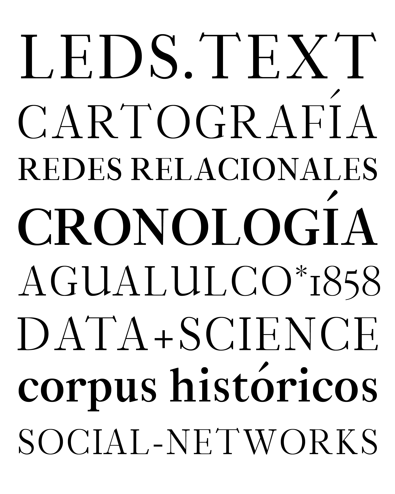

# LEDS Text

**LEDS Text** es la familia tipográfica oficial del **Laboratorio de Estructuras Sociales (LEDS)**, perteneciente a la Facultad del Hábitat de la Universidad Autónoma de San Luis Potosí (UASLP).

Este repositorio aloja el archivo fuente de diseño y las compilaciones de producción de la familia, estructurados bajo estándares profesionales de desarrollo tipográfico y control de versiones.

## Estructura de la Familia (5 Estilos - Release v1.2.0)
La familia compilada en producción se compone de **5 pesos** en su variante **Upright** (Romana), disponibles en formatos **OTF** (Desktop) y **WOFF** (Web):

| Estilo / Instancia | Weight Class | Archivo OTF (Desktop) | Archivo WOFF (Web) | PostScript Name |
| :--- | :---: | :--- | :--- | :--- |
| **Light** | 300 | `LEDSTextLight.otf` | `LEDSTextLight.woff` | `LEDSTextLight` |
| **Regular** | 400 | `LEDSTextRegular.otf` | `LEDSTextRegular.woff` | `LEDSTextRegular` |
| **Medium** | 500 | `LEDSTextMedium.otf` | `LEDSTextMedium.woff` | `LEDSTextMedium` |
| **SemiBold** | 600 | `LEDSTextSemibold.otf` | `LEDSTextSemibold.woff` | `LEDSTextSemibold` |
| **Bold** | 700 | `LEDSTextBold.otf` | `LEDSTextBold.woff` | `LEDSTextBold` |

## Especificaciones Técnicas (Font Specs)
* **Formatos de Distribución:**
  * **Desktop / Print:** OpenType CFF (`.otf`) compilado con curvas PostScript (cúbicas).
  * **Web:** Web Open Font Format (`.woff`).
* **Ubicación de Compilación y Release:** [`builds/release/`](builds/release/) (paquete `.zip`), [`builds/otf/proof/`](builds/otf/proof/) (`.otf`), [`builds/woff/proof/`](builds/woff/proof/) (`.woff`).
* **Unidades por Em (UPM):** 1024.
* **Set de Glifos por Archivo:** 380 glifos (cobertura Latin extendida con diacríticos, versalitas y ligaduras).
* **OpenType Features (GSUB):** 
  * `aalt` — *Access All Alternates*
  * `case` — *Case-Sensitive Forms*
  * `ccmp` — *Glyph Composition/Decomposition*
  * `liga` — *Standard Ligatures*
  * `locl` — *Localized Forms*
* **Soporte Lingüístico:** Cobertura de 153 lenguas con base latina (100% de cobertura en 16 lenguas clave como Checo, Finlandés, Galés, Irlandés y Español).

## Estado de Producción
Las **5 instancias estáticas** en formatos **OTF** y **WOFF** listas para distribución se ubican en:
* [`builds/release/`](builds/release/) — Paquete oficial de distribución (`LEDS_Text_v1.20.zip`), incluyendo fuentes OTF, WOFF y documentación interna (`CHANGELOG.md` y `EULA.md`).
* [`builds/otf/proof/`](builds/otf/proof/) — Archivos binarios individuales `.otf` (Desktop).
* [`builds/woff/proof/`](builds/woff/proof/) — Archivos binarios individuales `.woff` (Web).

El archivo fuente máster en formato Glyphs ([`sources/LEDS_Text.glyphs`](sources/LEDS_Text.glyphs)) se encuentra estructurado en [`sources/`](sources/) para facilitar el mantenimiento y la compilación de futuras versiones.

## Sobre el Laboratorio
El Laboratorio de Estructuras Sociales (LEDS) es un espacio de investigación y análisis enfocado en articular el diseño gráfico contemporáneo con la tecnología y las estructuras sociales.
Sitio web oficial: [https://leds.uaslp.mx](https://leds.uaslp.mx)

---

## Pruebas de Rendering y QA
1. Descarga las fuentes compiladas desde [`builds/release/`](builds/release/) o explora las versiones individuales en [`builds/otf/proof/`](builds/otf/proof/) y [`builds/woff/proof/`](builds/woff/proof/).
2. **Fuentes Desktop (OTF):** Instala los archivos `.otf` en tu sistema operativo o gestor de fuentes y valida la vinculación de estilos (*Style Linking*) con el atajo de teclado (**B** / **Cmd+B** para negrita).
3. **Pruebas de Calidad:** Las validaciones de metadatos y contornos se ejecutan mediante *Fontbakery* y se registran en [`tests/fontbakery/`](tests/fontbakery/).

## Licencia y EULA
Esta tipografía se distribuye bajo la licencia abierta **SIL Open Font License 1.1** detallada en el archivo [LICENSE.txt](LICENSE.txt). Puedes consultar los términos de uso y derechos de distribución en el [Acuerdo de Licencia de Usuario Final (EULA.md)](EULA.md).
